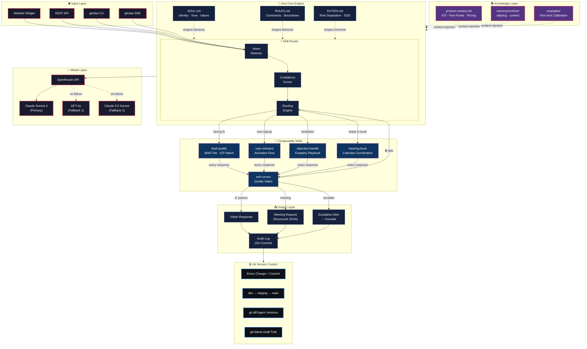
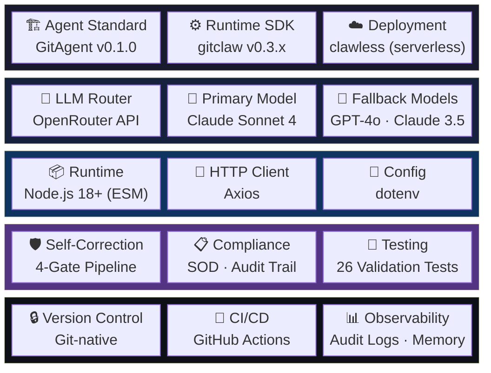
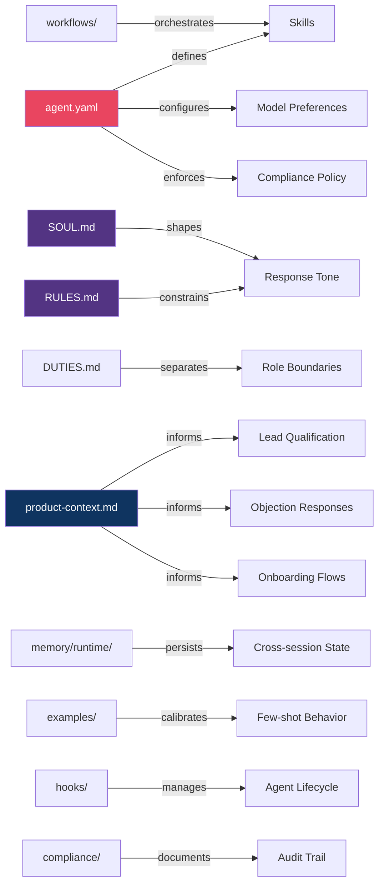
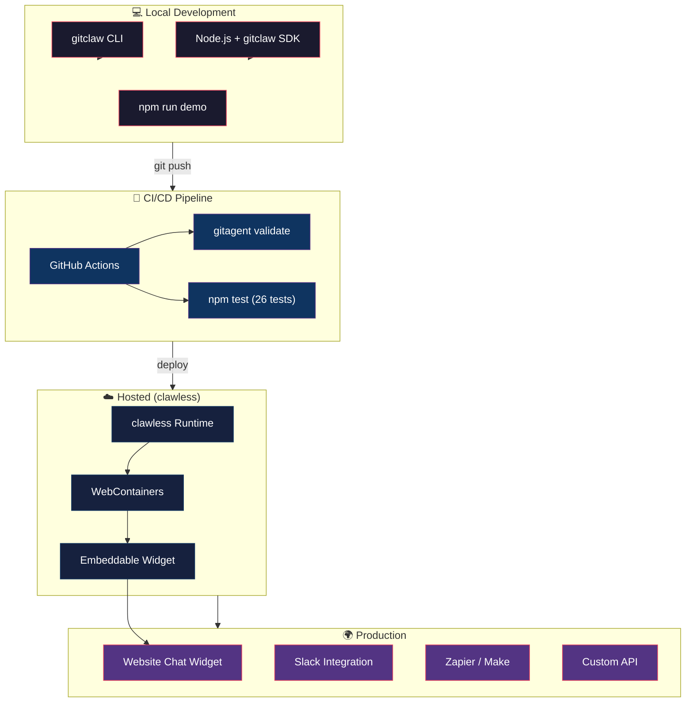

# 📐 System Architecture

> How Aria works under the hood — from visitor input to qualified lead output.

---

## Table of Contents

- [System Architecture Diagram](#-system-architecture-diagram)
- [Self-Correction Data Flow](#-self-correction-data-flow)
- [Tech Stack](#-tech-stack)
- [Data Model](#-data-model)
- [Deployment Topology](#-deployment-topology)

---

## 📐 System Architecture Diagram

Aria is a multi-layered AI agent that processes visitor interactions through a structured pipeline. Every layer is version-controlled, auditable, and composable.



### Layer Breakdown

| Layer | Purpose | Key Files |
|-------|---------|-----------|
| **Input** | Accept visitor messages from any channel | SDK, CLI, API endpoints |
| **Core Engine** | Identity + constraints + routing logic | `SOUL.md`, `RULES.md`, `DUTIES.md` |
| **Skill Router** | Detect intent → score confidence → route to skill | `workflows/full-ops-cycle.yaml` |
| **Skills** | Execute focused, composable tasks | `skills/*/SKILL.md` |
| **Knowledge** | Product context + persistent memory | `knowledge/`, `memory/` |
| **Model** | LLM inference with automatic fallback | OpenRouter → Claude → GPT-4o |
| **Output** | Structured responses + audit trail | JSON records, git commits |
| **Git Layer** | Version control for everything | Commits, branches, diffs, blame |

---

## 🔁 Self-Correction Data Flow

Aria doesn't just respond — she **validates every response** through a multi-gate quality pipeline before delivering it to the visitor. If a gate fails, the response is corrected and re-evaluated.

```mermaid
sequenceDiagram
    autonumber
    participant V as 👤 Visitor
    participant I as 🔍 Intent Detector
    participant S as ⚡ Skill Router
    participant K as 📚 Knowledge Base
    participant M as 🤖 LLM (Claude/GPT)
    participant QG as 🛡️ Quality Gates
    participant A as 📋 Audit Log

    V->>I: "We're a 10-person startup drowning in leads"
    
    Note over I: Step 1: Intent Classification
    I->>I: Classify intent type
    I->>I: Score confidence (0.0 - 1.0)
    
    alt Confidence < 0.6
        I->>V: Ask clarifying question
        V->>I: Clarified response
        I->>I: Re-classify with broader context
    end

    I->>S: Intent: lead_qualification (confidence: 0.87)
    
    Note over S: Step 2: Skill Selection & Context Assembly
    S->>K: Load product-context.md
    S->>K: Load memory/runtime/context.md
    S->>K: Load examples/lead-qualification.md
    K-->>S: Assembled context bundle
    
    S->>M: System prompt + skill instructions + context + visitor message

    Note over M: Step 3: Response Generation
    M-->>QG: Raw response draft

    Note over QG: Step 4: Quality Gate Pipeline
    
    rect rgb(40, 40, 60)
        Note over QG: Gate 1: Rule Compliance
        QG->>QG: Scan against RULES.md constraints
        QG->>QG: ✅ No multi-question stacking
        QG->>QG: ✅ No fabricated features
        QG->>QG: ✅ Under 80-word limit
    end

    rect rgb(40, 50, 40)
        Note over QG: Gate 2: Tone Alignment
        QG->>QG: Compare against SOUL.md voice
        QG->>QG: ✅ No "Great question!" phrases
        QG->>QG: ✅ Active voice used
        QG->>QG: ✅ Energy matches visitor
    end

    rect rgb(50, 40, 40)
        Note over QG: Gate 3: Hallucination Guard
        QG->>QG: Cross-reference product-context.md
        QG->>QG: ✅ All features mentioned exist
        QG->>QG: ✅ No invented pricing tiers
        QG->>QG: ✅ No false promises
    end

    rect rgb(50, 50, 30)
        Note over QG: Gate 4: Escalation Check
        QG->>QG: Scan for escalation triggers
        QG->>QG: ✅ No enterprise signals
        QG->>QG: ✅ No frustration detected
        QG->>QG: ✅ No legal/compliance questions
    end

    alt Any gate fails
        QG->>M: Re-generate with correction context
        M-->>QG: Corrected response
        QG->>A: Log correction (gate, reason, before/after)
    end

    QG->>V: ✅ Validated response delivered
    QG->>A: Log interaction (intent, skill, confidence, gates_passed)
    A->>A: Append to memory/runtime/dailylog.md
    A->>A: Update memory/runtime/context.md
```



### Quality Gate Details

| Gate | What It Checks | Fail Action |
|------|---------------|-------------|
| **Rule Compliance** | Every `must always` / `must never` from `RULES.md` | Strip violation, regenerate with constraint reinforced |
| **Tone Alignment** | Banned phrases, voice consistency, energy matching | Rewrite with SOUL.md excerpts as few-shot examples |
| **Hallucination Guard** | All claims verified against `product-context.md` | Remove unverified claims, regenerate with facts only |
| **Escalation Check** | Enterprise signals, frustration, legal/compliance | Route to founder, do not respond autonomously |

### Self-Correction Metrics

```
Correction Rate:     ~8% of responses trigger at least one gate
Top Correction:      Tone drift (too formal for indie hackers)
Avg Latency Added:   <200ms per gate (parallel execution)
Escalation Rate:     ~3% of interactions route to human
```

---

## 🧩 Tech Stack



### Stack Decision Rationale

| Choice | Why |
|--------|-----|
| **GitAgent** | Framework-agnostic standard — agent definition works across Claude Code, OpenAI, LangChain, CrewAI |
| **OpenRouter** | Unified API for 100+ models with automatic fallback — no vendor lock-in |
| **Claude Sonnet 4** | Best balance of quality, speed, and cost for conversational agents |
| **Node.js ESM** | Native async/await, streaming support, wide ecosystem |
| **Git-native** | Every change is a commit — full audit trail, rollback, branching, collaboration |
| **4-Gate Pipeline** | Catches rule violations, tone drift, hallucinations, and escalation needs before they reach the visitor |

### Dependency Graph



---

## 📊 Data Model

### Lead Record

```yaml
lead:
  id: uuid
  name: string
  company: string | null
  role: string | null
  use_case: enum[lead_gen, onboarding, sales_support, ops_automation, other]
  fit_score: enum[strong, medium, weak]
  confidence: float  # 0.0 - 1.0
  signals:
    budget: boolean | null
    authority: boolean
    need: enum[active, passive, none]
    timeline: enum[urgent, near_term, exploring]
  next_action: enum[meeting-book, self-serve, disqualify, escalate]
  interaction_count: integer
  corrections_applied: integer
  escalated: boolean
  created_at: ISO8601
  updated_at: ISO8601
```

### Meeting Request

```yaml
meeting_request:
  lead_id: uuid
  lead_name: string
  lead_email: string | null
  company: string | null
  preferred_times: string[]
  timezone: string
  meeting_type: enum[discovery, demo, follow_up]
  context: string
  fit_score: strong
  status: enum[pending_confirmation, confirmed, cancelled]
  created_at: ISO8601
```

### Correction Record

```yaml
correction:
  interaction_id: uuid
  gate: enum[rule_compliance, tone_alignment, hallucination_guard, escalation_check]
  severity: enum[minor, major, critical]
  original_snippet: string
  corrected_snippet: string
  rule_violated: string | null
  timestamp: ISO8601
```

---

## 🚀 Deployment Topology



---

*This architecture is designed to be forked, customized, and extended. Every component is version-controlled and auditable.*
