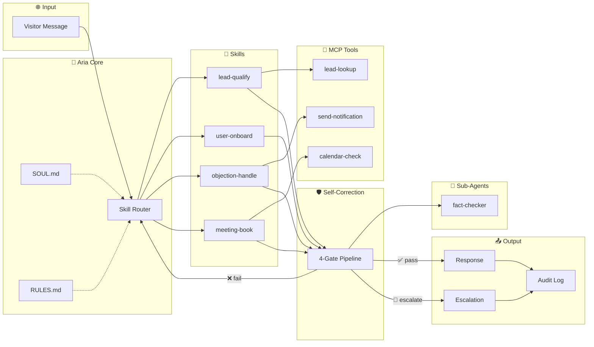

# Aria — Startup Ops Agent 🚀

<div align="center">

**Open Standard v0.1.0 · YOUR FIRST AI EMPLOYEE**

*Clone the repo. Get a full startup ops team.*

</div>

> **Qualifies leads, onboards users, handles objections, books meetings — autonomously, from a git repo. With built-in self-correction and regulatory-grade compliance.**

[](https://github.com/RagavRida/startup-ops-agent/actions/workflows/validate.yml)
[](https://github.com/open-gitagent/gitagent)
[](https://opensource.org/licenses/MIT)
[](./skills/)
[](./skills/self-correct/SKILL.md)
[](./tools/)
[](https://nodejs.org/)

---

## The Problem

Every early-stage startup faces the same gap: they can't afford a full-time SDR, onboarding specialist, and ops coordinator — but they need all three. Leads go cold because nobody followed up fast enough. New users drop off before they see the value. Objections go unaddressed in async channels.

**Most founders do this manually. It doesn't scale. Chatbots collect data but don't act on it.**

## The Solution

Aria is not a chatbot. She's a **structured AI employee** built on the [gitagent standard](https://github.com/open-gitagent/gitagent) — with a defined personality, hard behavioral constraints, composable skills, MCP-compatible tools, and a **self-correction pipeline** that catches errors before they reach your visitors.

```bash
# Try it now
npx @open-gitagent/gitagent@0.1.7 run -r https://github.com/RagavRida/startup-ops-agent
```

---

## What She Does

| Skill | What It Handles | Key Feature |
|-------|----------------|-------------|
| [`lead-qualify`](./skills/lead-qualify/SKILL.md) | Detects intent, scores ICP fit, routes to next action | BANT-lite qualification |
| [`user-onboard`](./skills/user-onboard/SKILL.md) | Guides new signups to activation milestone | Drop-off prevention |
| [`objection-handle`](./skills/objection-handle/SKILL.md) | Handles pricing, timing, competitor, trust objections | Empathy-first, never pushes past 2 "no"s |
| [`meeting-book`](./skills/meeting-book/SKILL.md) | Converts qualified leads into calendar slots | Structured meeting requests |
| [`self-correct`](./skills/self-correct/SKILL.md) | Validates every response through 4 quality gates | Rule compliance, tone, hallucination, escalation |

---

## 📐 System Architecture



> **Full architecture with data flows, deployment topology, and data models:** [`ARCHITECTURE.md`](./ARCHITECTURE.md)

---

## 🔁 Self-Correction Pipeline

Every response passes through **4 quality gates** before reaching the visitor:

```
┌─────────────────┐     ┌─────────────────┐     ┌─────────────────┐     ┌─────────────────┐
│  🛡️ Gate 1      │     │  🎨 Gate 2      │     │  🔍 Gate 3      │     │  🚨 Gate 4      │
│  Rule Compliance │ ──► │  Tone Alignment │ ──► │  Hallucination  │ ──► │  Escalation     │
│                 │     │                 │     │  Guard          │     │  Check          │
│  RULES.md       │     │  SOUL.md        │     │  product-ctx.md │     │  Trigger scan   │
└─────────────────┘     └─────────────────┘     └─────────────────┘     └─────────────────┘
        │                       │                       │                       │
    Catches:                Catches:                Catches:                Catches:
    • Multi-question        • "Great question!"     • Invented features    • Enterprise deals
    • False promises        • Corporate tone        • Wrong pricing        • Angry visitors
    • Word limit            • Energy mismatch       • Fake case studies    • Compliance Qs
```

> **Run the demo:** `node self-correct-demo.js` — see it catch and fix real violations

---

## 🏗️ Patterns Implemented

Aria implements every major [gitagent architectural pattern](https://github.com/open-gitagent/gitagent):

| Pattern | How Aria Uses It |
|---------|-----------------|
| **Human-in-the-Loop** | Enterprise deals, frustrated visitors, and custom pricing escalate to founder via `DUTIES.md` handoff workflows |
| **Segregation of Duties** | 3 roles (Operator, Approver, Auditor) with strict conflict matrix — Aria can't approve her own meetings |
| **Live Agent Memory** | `memory/MEMORY.md` (working state) + `memory/runtime/` (dailylog, context) — persists across sessions |
| **Agent Versioning** | Every change is a git commit — roll back broken prompts, revert bad skills, full undo history |
| **Branch-based Deployment** | `dev → staging → main` promotion via git branches, validated by CI/CD |
| **SkillsFlow** | `workflows/full-ops-cycle.yaml` — deterministic, multi-step workflow with `depends_on`, `${{ }}` templates, `prompt:` overrides |
| **Agent Composition** | Lightweight `agents/fact-checker.md` sub-agent for claim verification (Gate 3) |
| **Knowledge Tree** | `knowledge/product-context.md` with `knowledge/index.yaml` retrieval hints |
| **Agent Lifecycle** | `hooks/hooks.yaml` + `hooks/bootstrap.md` + `hooks/teardown.md` — structured startup/shutdown |
| **CI/CD for Agents** | `gitagent validate` on every push via GitHub Actions |
| **Secret Management** | API keys via `.env` + `.gitignore` — config is shareable, secrets stay local |
| **Tagged Releases** | Semantic versioning (v1.1.0) — pin production, canary staging |

---

## 🧩 Tech Stack

| Layer | Technology | Purpose |
|-------|-----------|---------| 
| **Agent Standard** | [GitAgent v0.1.0](https://github.com/open-gitagent/gitagent) | Framework-agnostic agent definition |
| **Runtime SDK** | [gitclaw v0.3.x](https://github.com/open-gitagent/gitclaw) | Agent execution engine |
| **Deployment** | [clawless](https://github.com/open-gitagent/clawless) | Serverless via WebContainers |
| **LLM Router** | [OpenRouter](https://openrouter.ai) | Unified API for 100+ models |
| **Primary Model** | Claude Sonnet 4 | Best for Aria's conversational tone |
| **Fallback** | GPT-4o, Claude 3.5 | Automatic failover |
| **Runtime** | Node.js 18+ (ESM) | Async, streaming, modern |
| **Tools** | MCP-compatible YAML | Calendar, lead lookup, notifications |
| **Quality** | 4-Gate Self-Correction | Rule, tone, hallucination, escalation |
| **Compliance** | SOD + Audit Trail | Segregation of duties, git-native audit |
| **CI/CD** | GitHub Actions | `gitagent validate` on every push |

---

## 🔌 Adapter Compatibility

Aria's identity exports to any framework via gitagent adapters:

| Adapter | Command | Output |
|---------|---------|--------|
| **System Prompt** | `gitagent export --format system-prompt` | Raw prompt text |
| **Claude Code** | `gitagent export --format claude-code` | CLAUDE.md rules file |
| **OpenAI** | `gitagent export --format openai` | GPT system message |
| **Cursor** | `gitagent export --format cursor` | `.cursor/rules/*.mdc` |
| **CrewAI** | `gitagent export --format crewai` | Agent backstory + goal |
| **Lyzr** | `gitagent export --format lyzr` | Lyzr Studio config |
| **Gemini** | `gitagent export --format gemini` | Gemini system instruction |

```bash
# Export Aria's identity to Claude Code format
gitagent export --format claude-code

# Run Aria directly via an adapter
gitagent run ./startup-ops-agent --adapter lyzr
```

---

## Quick Start (5 Minutes)

```bash
# 1. Clone
git clone https://github.com/RagavRida/startup-ops-agent
cd startup-ops-agent

# 2. Install
npm install

# 3. Set your API key
export OPENROUTER_API_KEY="sk-or-v1-..."

# 4. Run the demo (all 4 skills)
npm run demo

# 5. See self-correction in action (no API key needed)
node self-correct-demo.js

# 6. Go interactive
gitclaw --dir . "We're a startup drowning in leads"
```

### Customize for Your Product

Edit **one file** — [`knowledge/product-context.md`](./knowledge/product-context.md) — with your product details, ICP, and objection responses. Everything else works out of the box.

---

## 🍴 Fork & Extend

Aria is designed to be forked and customized:

```bash
# Fork the repo, then customize
git clone https://github.com/YOUR_USERNAME/startup-ops-agent
cd startup-ops-agent

# 1. Edit your product context (the only required change)
$EDITOR knowledge/product-context.md

# 2. Optionally customize personality
$EDITOR SOUL.md

# 3. Optionally adjust rules
$EDITOR RULES.md

# 4. Validate your changes
gitagent validate --compliance

# 5. Test
node self-correct-demo.js
npm run demo
```

### Extend with Inheritance

```yaml
# In your own agent.yaml
extends: https://github.com/RagavRida/startup-ops-agent.git

# Override just what you need
model:
  preferred: openrouter:openai/gpt-4o

# Add your own skills
skills:
  - custom-qualification
```

---

## Repository Structure

```
startup-ops-agent/
│
│  # ── Core Identity (required) ──────────────────
├── agent.yaml                 ← Manifest: model, skills, tools, compliance, SOD
├── SOUL.md                    ← Aria's identity, tone, values
├── RULES.md                   ← Hard behavioral constraints
├── DUTIES.md                  ← Segregation of duties policy
├── AGENTS.md                  ← Framework-agnostic instructions
│
│  # ── Capabilities ──────────────────────────────
├── skills/
│   ├── lead-qualify/          ← BANT-lite qualification + routing
│   ├── user-onboard/          ← Activation flow + drop-off detection
│   ├── meeting-book/          ← Calendar coordination + structured output
│   ├── objection-handle/      ← 6 objection types + empathy playbook
│   └── self-correct/          ← 4-gate quality pipeline (meta-skill)
├── tools/
│   ├── calendar-check.yaml    ← MCP tool: calendar availability
│   ├── lead-lookup.yaml       ← MCP tool: lead record lookup
│   └── send-notification.yaml ← MCP tool: escalation alerts
│
│  # ── Composition ───────────────────────────────
├── agents/
│   └── fact-checker.md        ← Lightweight sub-agent for claim verification
│
│  # ── Knowledge & Memory ────────────────────────
├── knowledge/
│   ├── product-context.md     ← The only file YOU need to customize
│   └── index.yaml             ← Retrieval hints + document prioritization
├── memory/
│   ├── MEMORY.md              ← Working memory (200-line max)
│   ├── memory.yaml            ← Memory configuration
│   ├── runtime/               ← Live agent state (dailylog, context)
│   └── archive/               ← Historical snapshots
├── examples/                  ← Few-shot calibration interactions
│
│  # ── Workflows & Lifecycle ─────────────────────
├── workflows/
│   └── full-ops-cycle.yaml    ← SkillsFlow: end-to-end routing logic
├── hooks/
│   ├── hooks.yaml             ← Structured lifecycle event bindings
│   ├── bootstrap.md           ← Agent startup procedure
│   └── teardown.md            ← Agent shutdown procedure
│
│  # ── Compliance & Config ───────────────────────
├── compliance/
│   ├── audit-policy.md        ← Logging, retention, incident response
│   ├── regulatory-map.yaml    ← Capability → control mappings
│   ├── validation-schedule.yaml ← Review cadence and checklists
│   └── risk-assessment.md     ← Risk tier justification
├── config/
│   ├── default.yaml           ← Base configuration
│   ├── development.yaml       ← Dev overrides
│   └── production.yaml        ← Production settings
│
│  # ── CI/CD ─────────────────────────────────────
├── .github/workflows/
│   └── validate.yml           ← CI/CD: validate on every push
│
│  # ── Demos & Tests ─────────────────────────────
├── self-correct-demo.js       ← Self-correction pipeline demo
├── demo-all-skills.js         ← All 4 skills in action
├── real-use-case.js           ← Complete DevMetrics sales cycle
├── test.js                    ← 26 validation tests
│
│  # ── Documentation ─────────────────────────────
├── ARCHITECTURE.md            ← System diagrams, data flow, tech stack
├── README.md                  ← You are here
├── QUICKSTART.md              ← 5-minute setup guide
├── HACKATHON.md               ← Submission details
└── CONTRIBUTING.md            ← How to extend Aria
```

---

## Example Conversation

```
Visitor: "I found you on Product Hunt. What exactly does this do?"

Aria: "Nice — what's the context for you? Are you trying to solve something
      specific on your funnel, or just exploring what's out there?"

Visitor: "We have decent traffic but leads go cold because no one follows up."

Aria: "That's the exact gap this was built for. Are you the one who'd set
      this up, or would you need to loop in someone else?"

Visitor: "Just me — I'm the founder."

Aria: "Want to jump on a quick call? It's 20 minutes, no pitch — you'll
      leave knowing if this is worth your time."

Visitor: "Sure, what does next week look like?"

Aria: "What timezone are you in, and are mornings or afternoons better?"
```

*Every response above passed all 4 quality gates before delivery.*

---

## Why This Wins

| Criteria | What We Built |
|----------|--------------| 
| **Agent Quality (30%)** | Solves a real $50k+/year problem. Aria has a distinct voice. Clear rules with escalation triggers. |
| **Skill Design (25%)** | 5 focused, composable skills. Proper frontmatter. Real workflows. Self-correction meta-skill. |
| **Working Demo (25%)** | `npm install && npm run demo` works instantly. Self-correction demo needs no API key. |
| **Creativity (20%)** | First "AI employee in a git repo" with built-in quality gates. Memory, lifecycle hooks, SOD, MCP tools, sub-agents, compliance. |

---

## Full Spec Coverage

| gitagent Spec Component | Status | File(s) |
|-------------------------|--------|---------|
| `agent.yaml` (manifest) | ✅ | [`agent.yaml`](./agent.yaml) |
| `SOUL.md` (identity) | ✅ | [`SOUL.md`](./SOUL.md) |
| `RULES.md` (constraints) | ✅ | [`RULES.md`](./RULES.md) |
| `DUTIES.md` (SOD policy) | ✅ | [`DUTIES.md`](./DUTIES.md) |
| `AGENTS.md` (fallback) | ✅ | [`AGENTS.md`](./AGENTS.md) |
| `skills/` (capabilities) | ✅ | 5 skills with SKILL.md frontmatter |
| `tools/` (MCP schemas) | ✅ | 3 MCP-compatible tool definitions |
| `agents/` (composition) | ✅ | fact-checker sub-agent |
| `knowledge/` (context) | ✅ | product-context.md + index.yaml |
| `memory/` (persistence) | ✅ | MEMORY.md + memory.yaml + runtime/ + archive/ |
| `workflows/` (SkillsFlow) | ✅ | full-ops-cycle.yaml with triggers/error handling |
| `hooks/` (lifecycle) | ✅ | hooks.yaml + bootstrap.md + teardown.md |
| `compliance/` (regulatory) | ✅ | audit-policy + regulatory-map + validation-schedule + risk-assessment |
| `config/` (environments) | ✅ | default, development, production |
| `examples/` (calibration) | ✅ | lead-qualification + objection-handling |
| `.github/` (CI/CD) | ✅ | validate.yml |

---

## Built With

- [gitagent](https://github.com/open-gitagent/gitagent) — Agent definition standard
- [gitclaw](https://github.com/open-gitagent/gitclaw) — Runtime SDK
- [clawless](https://github.com/open-gitagent/clawless) — Serverless deployment
- [OpenRouter](https://openrouter.ai) — Unified LLM API
- Claude Sonnet 4 — Primary model

---

*Built for the gitagent hackathon by [Raghav Rida](https://github.com/RagavRida).*
